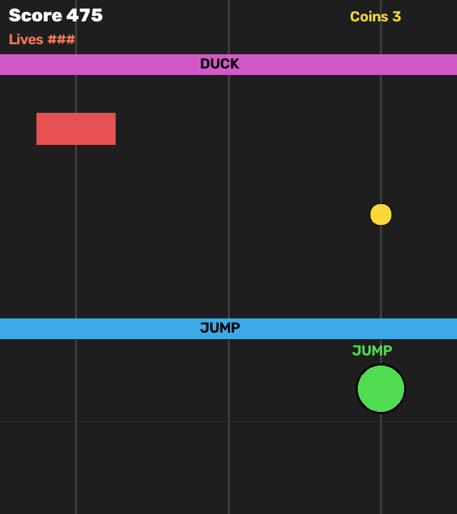

# SWS3026 Visual Computing Project — Emotion Effects Camera

An interactive webcam experience that recognises facial expressions in real time and turns them into animated visual effects.

Built for the SWS3026 Visual Computing course, this repository also contains the coursework experiments and bonus prototypes. The featured application for the Poster Showcase is the **RTMPose Emotion Effects Camera** in `expert/`.

## Preview

The repository includes this preview of the body-controlled Temple Run bonus game:



The featured expression-camera interface assets are also included in [`expert/assets/ui/`](expert/assets/ui/).

## What you can experience

Face the webcam and the application detects a face, estimates 106 facial landmarks, classifies the expression, and draws a matching effect over the live camera view. It supports these seven classes:

`angry`, `disgust`, `fear`, `happy`, `neutral`, `sad`, and `surprise`.

The runtime selects the largest detected face as the primary participant. Face detection uses MediaPipe with a Haar-cascade fallback, and the application smooths detections and recent predictions to make the experience steadier.

## Quick start

From a PowerShell terminal, clone the public repository and enter its root folder:

```powershell
git clone https://github.com/AmyBai0620/SWS3026-Visual-Computing-Project.git
cd SWS3026-Visual-Computing-Project
```

Create and activate a Python 3.10 virtual environment. Python 3.10 is the version used by the repository's final-clean experiment instructions.

```powershell
py -3.10 -m venv .venv
.\.venv\Scripts\Activate.ps1
python -m pip install --upgrade pip
python -m pip install -r experiments\expression_classification\requirements-final-clean.txt
```

Then complete the **Runtime dependencies** section below before starting the camera:

```powershell
python expert\run_emotion_camera.py
```

Run this command from the repository root. The program opens an OpenCV window named `RTMPose Emotion Camera v10 - Threaded Scrapbook UI`; model initialisation includes warm-up inference, so the first window can take a moment to appear.

## Runtime dependencies

`experiments/expression_classification/requirements-final-clean.txt` is a real, pinned file in this repository. It installs NumPy, OpenCV, MediaPipe, scikit-learn, Joblib, Matplotlib, Pandas, and Pillow.

The featured camera application additionally imports **PyTorch** and **MMPose** (plus its runtime dependencies). Repository benchmark records identify an environment with PyTorch 2.1.2, MMCV 2.1.0, MMEngine 0.10.7, MMDetection 3.2.0, and MMPose 1.3.2. However, this repository does **not** include a complete, platform-specific lock file or an installation script for that stack. Install a compatible PyTorch/MMPose stack for your operating system and Python version before running the application, then use the built-in check below.

```powershell
python expert\check_rtmpose_expression_pipeline.py --device auto
```

This check verifies the included classifier, scaler, RTMPose checkpoint, installed MMPose configuration, and an end-to-end synthetic inference path. It does not open the webcam.

## Prerequisites

- Windows has been exercised by this project. The camera code first uses the Windows DirectShow backend and then falls back to OpenCV's default camera backend.
- Python 3.10 is recommended by the repository's final-clean environment instructions.
- Git, a working webcam, and permission for Python to use the camera are required.
- A CUDA-capable GPU is optional. The application requests `device="auto"` and uses CUDA when PyTorch reports it is available; otherwise it uses CPU.
- A reasonably well-lit, front-facing view works best. Keep your face visible and avoid heavy occlusion.

macOS and Linux have not been verified in this repository. The fallback `cv2.VideoCapture(0)` may work there, but it is not a tested compatibility claim.

## How to play

1. Start the application from the repository root with `python expert\run_emotion_camera.py`.
2. Allow camera access if Windows asks for it.
3. Sit in front of the camera with your face clearly visible. In a multi-person scene, the largest detected face is used.
4. Make an expression and wait briefly for the smoothed label and matching animated effect.

The program starts with effects enabled and automatic expression recognition active.

| Key | Action |
| --- | --- |
| `Q` | Quit and close the camera window |
| `E` | Toggle visual effects |
| `D` | Toggle debug details |
| `1`–`7` | Preview Angry, Disgust, Fear, Happy, Neutral, Sad, or Surprise respectively |
| `0` | Leave preview mode and return to automatic recognition |

Preview keys are useful for viewing every effect even when a particular expression is hard to reproduce.

## Required models and assets

All files required by the featured runtime are already versioned in this repository; no separate model download is referenced by the code.

| Path | Used for |
| --- | --- |
| `expert/models/rtmpose_expression/classifier.joblib` | Seven-class expression classifier |
| `expert/models/rtmpose_expression/scaler.joblib` | Feature normalisation |
| `expert/models/rtmpose_face/rtmpose-m_simcc-face6_pt-in1k_120e-256x256-72a37400_20230529.pth` | RTMPose-Face landmark checkpoint |
| `expert/assets/effects/<emotion>/` | Per-expression manifest and PNG effect layers |
| `expert/assets/ui/sidebar/` | Scrapbook sidebar artwork |

The RTMPose code looks up the model configuration named `rtmpose-m_8xb256-120e_face6-256x256.py` inside the installed MMPose package. The pipeline check will report a clear error if that configuration is missing from the installed version.

## Repository structure

```text
SWS3026-Visual-Computing-Project/
├── README.md
├── expert/
│   ├── run_emotion_camera.py              # Featured application entry point
│   ├── realtime_demo_v10_threaded.py      # Camera, controls, detection, and display loop
│   ├── rtmpose_emotion_recognizer.py      # Landmark features, scaling, and classification
│   ├── models/                            # Included classifier, scaler, and checkpoint
│   └── assets/                            # Included effects and scrapbook UI artwork
├── beginner/                              # Face detection and landmark coursework
├── bonus/                                 # Pose/dance bonus prototypes
└── experiments/                           # Evaluation scripts, records, and base requirements
```

## Bonus applications

The `bonus/` folder contains two additional webcam-based applications. They use Ultralytics YOLO pose estimation and the included `bonus/yolov8n-pose.pt` model. `ultralytics` is not listed in the repository's pinned final-clean requirements file, so install a compatible version in the active environment before using either bonus application.

### Temple Run — body-controlled runner

Start it from the repository root:

```powershell
python bonus\temple_run.py
```

This OpenCV game uses webcam shoulder positions. At the start, stand still for the short calibration. Then lean left or right to change lanes, raise your shoulders to jump, and lower them to duck.

| Key | Action |
| --- | --- |
| `Space` | Start, pause/resume, or play again after game over |
| `R` | Restart calibration during a game, pause, or results screen |
| `P` | Pause/resume during a game |
| `Q` or `Esc` | Quit |

The runner, obstacle, and HUD artwork is included under `bonus/assets/`; the game also has procedural fallbacks for missing scenery art. `python bonus\temple_run_demo.py` is an offline scripted check for the game logic and does not need a webcam.

### Just Dance — reference-vs-webcam score

Start it from the repository root:

```powershell
python bonus\just_dance.py
```

The Tk interface has **Start Webcam**, **Start Dance**, and **Stop Dance** buttons. It compares the live pose against a reference skeleton and shows a per-frame tier (`PERFECT`, `SUPER`, `GOOD`, or `X`) plus a numeric score.

Important: the repository includes precomputed reference skeleton files in `bonus/video/ref_dance_example_*.npz`, but it does **not** include the matching reference MP4 files required by `bonus/just_dance.py`. Its current default is `dance_example_1`, and it expects both `ref_dance_example_1.npz` and `dance_example_1.mp4` in either `bonus/` or `bonus/video/`. To use your own reference, place the MP4 in one of those locations, set `REF_NAME` in `bonus/just_dance.py` to the filename without `.mp4`, and run:

```powershell
python bonus\precompute_reference.py <reference-name>
```

This produces the required `ref_<reference-name>.npz` file. A webcam and camera permission are also required for live scoring.

## Technical pipeline

```text
Webcam frame
→ MediaPipe face detection (Haar fallback)
→ largest face selection
→ RTMPose-Face (106 landmarks + landmark confidence)
→ 318 normalised features
→ StandardScaler + expression classifier
→ smoothed label + animated visual effect
```

The display loop runs separately from a single background inference worker. New face crops replace an older pending crop, so slow inference does not build an ever-growing queue of old frames.

## Troubleshooting

| Problem | What to try |
| --- | --- |
| `ModuleNotFoundError` for `cv2`, `mediapipe`, `sklearn`, or `joblib` | Activate `.venv` and run the pinned requirements command again. |
| `ModuleNotFoundError` for `torch` or `mmpose` | Install a compatible PyTorch/MMPose runtime stack, then run `python expert\check_rtmpose_expression_pipeline.py --device auto`. |
| `Could not open the camera` | Close apps that may own the webcam (for example Teams, Zoom, or a browser), reconnect the camera, and check Windows camera privacy permissions. |
| A model or asset is reported missing | Start from the repository root and confirm the paths in **Required models and assets** exist. Do not move the `expert/models` or `expert/assets` folders. |
| MMPose configuration is missing | The installed MMPose package does not contain the configuration expected by this project. Use a compatible MMPose installation and re-run the pipeline check. |
| The window stops responding | Click the OpenCV window so it receives keyboard input; use `Q` to quit. |
| No face or unstable effects | Improve front lighting, centre your face, move closer, and remove heavy occlusion. The app uses the largest face when more than one person is present. |

## Privacy

The featured runtime captures frames from the local webcam for real-time processing. Its camera entry point and display loop do not contain code to write frames or video to disk, upload frames, or send them over the network. It releases the camera and closes OpenCV windows when you quit.

## Limitations

- Expression quality can vary with lighting, head pose, distance, occlusion, and camera quality.
- The classifier supports only the seven fixed classes listed above.
- CPU inference can be slower than GPU inference.
- Windows is the environment exercised by this project; macOS and Linux are not verified.
- A complete, platform-specific PyTorch/MMPose installation manifest is not currently provided in the repository.

## Course context and acknowledgements

This project was created for SWS3026 Visual Computing. The featured application uses OpenCV, MediaPipe, PyTorch, MMPose, scikit-learn, and Pillow. The included RTMPose-Face checkpoint and the respective upstream libraries remain subject to their own licences and terms.

## License

No separate `LICENSE` file is currently included in this repository.
