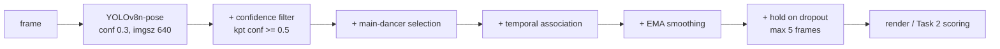

# Bonus Level — Task 1
## TikTok Dance Analysis: Keypoint Detection Challenges and How We Solved Them

> [!abstract] Summary
> The provided `danceapp.py` runs **YOLOv8n-pose** and draws **every** detected person, with no keypoint-confidence filtering and no temporal state. We kept the same detector and weights and added a post-processing layer. On the test clips this removed **32 → 2** identity switches on a TikTok clip with bystanders and **41 → 0** on a 5–7 person group dance, and cut median frame-to-frame keypoint displacement by **14.6–23.4%**. It is still below real time on CPU (**5.8 fps** on the 1804×1050 group clip), and left/right limb swaps remain unsolved.

> [!info] Rubric coverage
> **Q11 — "show screenshots or a video of your program in action"** → §1.
> **Q12 — "what challenges did you encounter in the detection *and rendering* of keypoints? How did you overcome these?"** → §2–§6, one section per challenge.
> Project brief, Task 1.3 — *"if there are multiple people in the video, how do you determine who is dancing?"* → §3, the core question.

---

## 1. The program in action (Q11)

Two programs, same detector, same weights:

| | Program | What it draws |
|---|---|---|
| **Before** | `danceapp.py` (provided, unmodified) | every detected person, no filtering |
| **After** | `danceapp_v2.py` (ours, built on `pose_pipeline.py`) | one selected dancer, filtered and smoothed |

**Video evidence — `bonus/video/compare4.mp4`** (14.5 s screen recording): the two programs side by side on the group-dance clip. Left window locks onto the central dancer; right window paints all five skeletons.

**Still evidence** — each figure runs the same frames through both drawing paths. The frames are fixed presets in [make_task1_figs.py:32-36](make_task1_figs.py#L32-L36), not picked per run.

![[bonus/task1_compare_dance_examle_4.png|800]]
*Group dance, 5–7 people in every frame. Left: all skeletons. Right: the same central dancer held across four separate timestamps.*

![[bonus/task1_compare_dance_example_2.png|800]]
*Real TikTok clip: one main dancer plus background bystanders.*

![[bonus/task1_compare_dance_example_1.png|800]]
*Single dancer, but YOLO detects the curtain and plant on the right as a second person.*

### Test clips

Following the brief ("no need to evaluate on the entire dataset"), six clips were used, spanning three difficulty levels. Three carry the quantitative report:

| Clip | Resolution | Frames | >1 person detected | Max people | Scene |
|---|---|---:|---:|---:|---|
| dance_example_1 | 1280×720 | 550 | 191 (34.7%) | 2 | single dancer + curtain false positive |
| dance_example_2 | 610×1082 | 661 | 588 (89.0%) | 7 | main dancer + bystanders (real TikTok) |
| dance_examle_4 | 1804×1050 | 531 | 531 (100%) | 7 | group dance |

The other three (`dance_example_3/5/6`) are easier cases used as controls: 1–4, 1–1 and 1–2 people respectively.

---

## 2. The four challenges

| # | Challenge | Where it hurts | Section |
|---|---|---|---|
| 1 | **Which of 7 people is the dancer?** | Task 2 scoring needs exactly one skeleton | §3 |
| 2 | **Phantom keypoints at (0, 0)** | bones stretch to the top-left corner | §4 |
| 3 | **Per-frame jitter** | skeleton shivers even when the dancer holds still | §5 |
| 4 | **Rendering and playback** | distorted frames, a panel that eats the other, wrong playback speed | §6 |

The full pipeline. Everything between the detector and the renderer is ours; the detector itself is untouched:



`pose_pipeline.py` is GUI-free on purpose, so Task 2 drives the **same `PoseTracker`** for both the reference video and the webcam.

---

## 3. Challenge 1 — Who is dancing? *(the core question)*

### 3.1 The problem is not rare

The provided code draws every detection ([danceapp.py:130-140](danceapp.py#L130-L140)). That is fine for a single-person clip and useless everywhere else: 89% of frames in `dance_example_2` and **100%** of frames in `dance_examle_4` contain more than one person, up to 7. Task 2 compares the user against the reference dancer — with seven skeletons on screen there is no defined answer to *which one*.

### 3.2 Scoring the candidates

For each detected person $i$ in a $W\times H$ frame with diagonal $D$:

$$
s_i=\underbrace{\sqrt{A_i/(WH)}}_{\text{size}}\times
\underbrace{\overline{c_i}}_{\text{mean kpt confidence}}\times
\underbrace{\left(1-0.5\min\!\left(1,\tfrac{d^{\text{cen}}_i}{D/2}\right)\right)}_{\text{centrality}}
$$

Each term earns its place, and the shape of each term matters as much as its presence:

- **Square root on area.** Box area spans two orders of magnitude between a foreground dancer and a background figure. Without the square root, area alone decides every frame and the other two terms are decoration.
- **Mean keypoint confidence** is what kills the curtain: a false positive has a plausible box but low-confidence joints.
- **Centrality is deliberately weak** (coefficient 0.5, so the worst corner keeps half its score). Dancers move to the edge of the frame constantly; a strong centre prior would hand the track to whoever stands in the middle.

### 3.3 Why that is still not enough — and the fix

On `dance_example_2` the competitors are **real humans** of similar size and similar confidence, so $s_i$ is nearly tied and the winner flips frame to frame. The naive score alone switches identity **32 times** in 661 frames.

The fix is a continuity bonus against the previous frame's selection:

$$
s_i \leftarrow s_i\left(1+0.8\max\left(0,\;1-\tfrac{d^{\text{prev}}_i}{D/3}\right)\right)
$$

> [!insight] What the bonus is actually worth
> It is a **hysteresis band**, not a lock. An incumbent that barely moved gets the full ×1.8. On `dance_example_2` ($D=1243$ px) a rival at the identity-switch threshold (186 px) gets ×1.44, so it needs a **25% higher base score** to take over; a rival beyond $D/3=414$ px gets no bonus and needs **80% more**. A genuinely better candidate can still win — which is what should happen when the dancer walks off and someone else takes the front.

### 3.4 Evidence that each step is worth its complexity

Three configurations, same detector, same frames, same threshold — only post-processing differs ([task1_ablation.py:30-34](task1_ablation.py#L30-L34)). **Identity switch** = the selected box centre jumps more than $0.15D$ between adjacent frames, so the criterion scales with resolution.

| Clip | A naive | B +continuity | C +smoothing (shipped) |
|---|---:|---:|---:|
| dance_example_1 — single + curtain | 0 switches / 5.75 px | 0 / 5.75 | **0 / 4.91** |
| dance_example_2 — dancer + bystanders | **32** / 6.82 | **2** / 6.27 | **2 / 4.80** |
| dance_examle_4 — group of 5–7 | **41** / 6.68 | **0** / 6.25 | **0 / 4.95** |

> [!success] The result worth presenting
> **The value of each step scales with difficulty.** Temporal association buys nothing on the single-dancer clip (0 → 0) and everything on the crowded ones (32 → 2, 41 → 0). That is the evidence that the design answers a measured problem rather than a guessed one — and it is why the multi-person clips had to be added to the test set in the first place.

**Why it does nothing on `dance_example_1`:** the interference there is a low-confidence, small-area false positive, not a person. The base score already ranks it far below the dancer, so no `argmax` changes. Naming the precondition — *competing candidates of similar size and confidence* — is more useful than averaging one number across all clips.

---

## 4. Challenge 2 — Phantom keypoints at (0, 0)

The provided code reads `keypoints.xyn` but never reads `keypoints.conf` ([danceapp.py:132](danceapp.py#L132)). YOLO returns occluded or out-of-frame joints as `(0, 0)`; multiplied by width and height they stay `(0, 0)`, so they pile into the top-left corner and drag bones across the whole frame.

Three guards, all in [pose_pipeline.py:155-159](pose_pipeline.py#L155-L159):

1. a keypoint is valid only if `conf >= 0.5`;
2. a bone is drawn only if **both** endpoints are valid — otherwise a single bad joint corrupts two bones;
3. high-confidence points sitting exactly at the origin are rejected explicitly, since the model does occasionally report them.

> [!warning] Honest scope
> On these six clips the failure **does not fire** — every dancer is framed full-body, and the `(0, 0)` count in the sampled frames is 0. It fires when a webcam frames a user from the waist up, so the convincing footage belongs to the Task 2 demo. We report the guard we wrote, not evidence we do not have.

Related: 92 of 550 frames in `dance_example_1` (16.7%) have **zero** detections. Rather than let the skeleton blink out during fast turns, the last pose is held for up to 5 frames (~0.17 s) and then cleared.

---

## 5. Challenge 3 — Jitter

Keypoints wobble a few pixels per frame even when the dancer holds a pose. The fix is an EMA with $\alpha=0.6$, applied **only to keypoints valid in both frames** so a filtered-out joint never leaks a stale coordinate into a good one.

Median frame-to-frame displacement, B → C in the table above: 5.75 → 4.91 (**−14.6%**), 6.27 → 4.80 (**−23.4%**), 6.25 → 4.95 (**−20.8%**). No configuration gains an identity switch from smoothing.

> [!note] Two caveats we state before being asked
> **The metric flatters the filter.** An EMA is a low-pass filter, so part of the drop is definitional rather than a discovery. What makes it still meaningful is that B → C changes exactly one thing, and that the cost is bounded: the steady-state lag of a first-order EMA is $(1-\alpha)/\alpha = 0.67$ frames, about **22 ms at 30 fps** — under one frame, which is why the skeleton does not visibly trail the dancer in the Task 2 side-by-side view.
> **It is not accuracy.** With no ground-truth annotation, these numbers measure *track stability*, not how close the joints are to the true anatomy. Saying so is cheaper than being asked.

---

## 6. Challenge 4 — Rendering and playback

Q12 asks about rendering as well as detection. Four defects surfaced in testing:

| Defect | Cause | Fix |
|---|---|---|
| Frames stretched, people too thin | hard resize to a fixed panel, ignoring aspect ratio — a 4:3 webcam in a portrait panel gets squashed | `fit_letterbox()`: scale by the **smaller** factor and pad, never stretch |
| Enlarging the window only added margin | panel size hard-coded | both panels `fill=BOTH, expand=True`; images built at the live panel size |
| **The reference panel gradually ate the webcam panel** | a Tk `Label` **requests** the size of its image, and geometry propagation is on by default: bigger image → bigger frame → bigger image next tick, a runaway feedback loop | fixed initial frame sizes + `pack_propagate(False)`, cutting the loop. *Verified headless:* 40 frames of 1280×720 forced into the left panel, widths stayed at 520 / 508 px |
| Video played at inference speed | no playback clock; the worker also touched Tk widgets directly | target frame index from the video's own fps, two-way correction; worker pushes to a `queue`, Tk main loop drains it via `after()` |

> [!insight] The bug that slow hardware was hiding
> The playback clock first only handled *behind* — skip frames with `cap.grab()` to catch up. On this CPU that looked correct, because inference at ~14 fps can never outrun a 30 fps video: **slow inference was accidentally acting as the throttle**. The bug only appeared in Task 2, where the reference side plays from precomputed skeletons and runs no inference at all — nothing slowed the loop, so the dance fast-forwarded. After fixing it there we back-ported the "wait when ahead" branch here, since any GPU machine would reproduce the fast-forward in Task 1 too.

---

## 7. Real-time cost

Inference time only, CPU (torch 2.7.1 CPU build), from the saved `task1_stats_*.txt`:

| Clip | Resolution | People | Mean / p95 (ms) | fps | vs 30 fps |
|---|---|---:|---:|---:|---:|
| dance_example_1 | 1280×720 | 1–2 | 71.7 / 88.3 | 13.9 | 2.2× too slow |
| dance_example_2 | 610×1082 | 1–7 | 67.9 / 93.4 | 14.7 | 2.0× too slow |
| dance_examle_4 | 1804×1050 | 5–7 | **173.9 / 472.2** | **5.8** | **5.2× too slow** |

Cost grows with both pixel count and people count; the group-dance p95 of 472 ms is about 2 fps in the worst frames.

> [!warning] Report this as a range, not a benchmark
> An earlier run of the same script on the same machine recorded 54 ms / 18.4 fps for `dance_example_1` against the saved 71.7 ms / 13.9 fps. Laptop CPU timing moves with thermal state and background load, so the honest claim is **roughly 14–18 fps for one 720p dancer**. The conclusion that none of the clips reaches 30 fps is unaffected.

**The trade-off we chose: drop frames, keep time.** Playback speed must stay correct because Task 2 scoring depends on temporal alignment between reference and webcam — better to skip a detection than to let the video run slow or fast. If more speed is needed, `imgsz` 640 → 480 helps most on the high-resolution group clip, where cost is pixel-bound; detecting every other frame is the next step, and the EMA already provides the temporal model to fill the gap.

---

## 8. What we did not solve

- **Left/right limb swaps.** COCO-17 tells left from right by appearance, so turning around or crossing the arms flips the labels. Unquantified and unfixed; it matters for Task 2 because a mirrored limb changes the compared joint angles.
- **"Main dancer" is ambiguous in a group.** The score always returns one answer and the continuity bonus keeps it *stable*, but stability is not correctness — in a 5–7 person routine the front-centre role may be shared. If Task 2 scores a group video, who is being imitated has to be agreed with the reference, not left to a heuristic.
- **Detector false positives remain.** We suppress the curtain's *consequences* by never selecting it, but YOLO still produces it every frame and still pays for it.
- **No ground truth.** All numbers here are stability measures. Even 200 hand-labelled frames would turn the jitter proxy into a real accuracy measurement.

---

## Appendix. Files and reproduction

```text
bonus/
├── danceapp.py           # provided original, unchanged — the "before" demo
├── pose_pipeline.py      # PoseTracker + rendering, GUI-free (shared with Task 2)
├── danceapp_v2.py        # Tk GUI on top of the pipeline
├── make_task1_figs.py    # -> task1_compare_<name>.png, task1_stats_<name>.txt
├── task1_ablation.py     # -> task1_ablation_<name>.txt
└── video/                # reference clips + compare4.mp4 demo recording
```

```bash
conda activate vcwork          # torch 2.7.1 CPU, opencv, ultralytics

cd bonus
python make_task1_figs.py dance_example_2         # figure + statistics
python task1_ablation.py     dance_example_2 661  # A / B / C ablation
python danceapp.py                                # before
python danceapp_v2.py                             # after
```

Shipped parameters: `det_conf=0.3`, `kpt_conf=0.5`, `smooth_alpha=0.6`, `hold_frames=5`, `imgsz=640`. Every figure and statistics file regenerates from the clips in `bonus/video/` with fixed shot frames and a resolution-scaled switch threshold, so a rerun reproduces the tables up to CPU timing variance.
