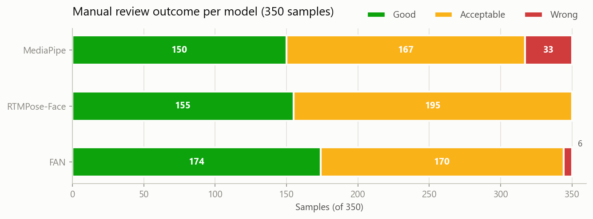
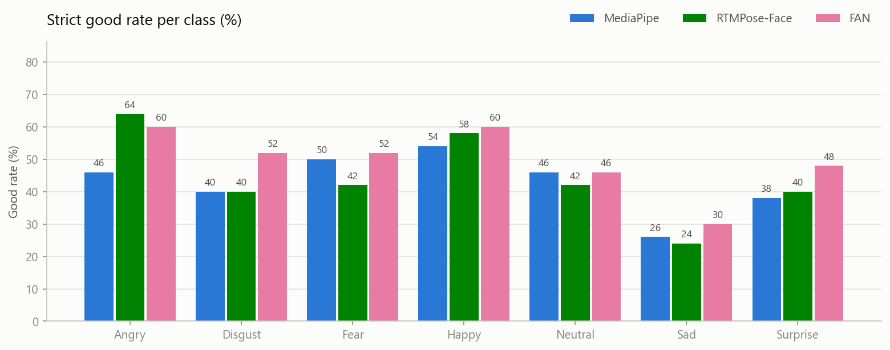
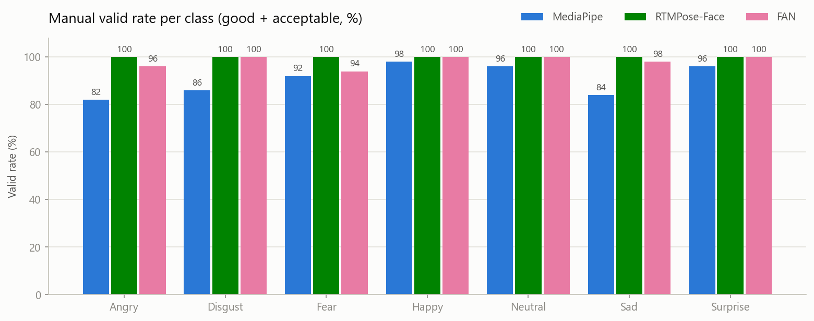
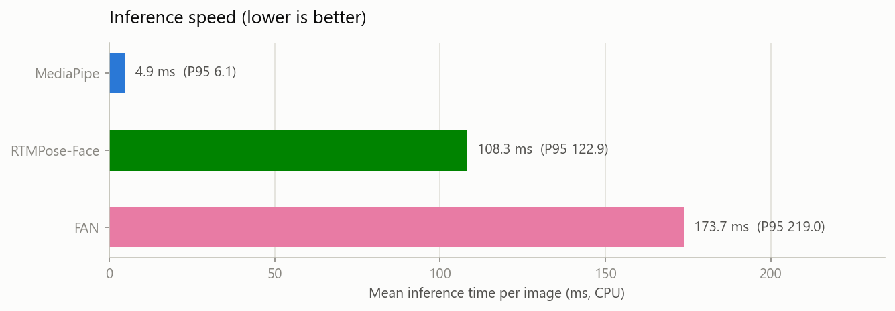

# 三模型关键点基准对比报告 (v1)

- 数据：FER-2013 train，7 类 × 50 张 = 350 张（`manifests/sample_manifest_350.csv`）
- 模型：MediaPipe Face Mesh 0.10.21（468 点，自带检测器）、RTMPose-M Face6 256x256（106 点）、2D FAN-4（68 点），均为 CPU 推理
- 本报告由 `compare_models.py` 从三份 `sample_metrics_reviewed.csv` 自动生成

## 1. 总体对比

| 指标 | MediaPipe | RTMPose-Face | FAN |
|---|---:|---:|---:|
| 原始提取成功率 | 90.57% | 100.00% | 100.00% |
| 人工有效率 (good+acceptable) | 90.57% | 100.00% | 98.29% |
| 严格 good 率 | 42.86% | 44.29% | 49.71% |
| Good / Acceptable / Wrong | 150 / 167 / 33 | 155 / 195 / 0 | 174 / 170 / 6 |
| 平均耗时 | 4.86 ms | 108.29 ms | 173.67 ms |
| 中位数耗时 | 4.86 ms | 107.03 ms | 163.64 ms |
| P95 耗时 | 6.06 ms | 122.91 ms | 219.03 ms |
| 平均关键点置信度 | — | 0.660 | 0.786 |

**口径说明（重要）**：RTMPose-Face 和 FAN 将整张图作为外部人脸框输入，被强制输出全部关键点，因此“原始成功率 100%”不代表全部对齐正确；MediaPipe 自带人脸检测器，其失败（33 张）为显式的“检测不到脸”。跨模型比较应以**人工有效率**与**严格 good 率**为准。

## 2. 分类别严格 good 率

| 类别 | MediaPipe | RTMPose-Face | FAN |
|---|---:|---:|---:|
| Angry | 46.00% | 64.00% | 60.00% |
| Disgust | 40.00% | 40.00% | 52.00% |
| Fear | 50.00% | 42.00% | 52.00% |
| Happy | 54.00% | 58.00% | 60.00% |
| Neutral | 46.00% | 42.00% | 46.00% |
| Sad | 26.00% | 24.00% | 30.00% |
| Surprise | 38.00% | 40.00% | 48.00% |

## 3. 分类别人工有效率 (good+acceptable)

| 类别 | MediaPipe | RTMPose-Face | FAN |
|---|---:|---:|---:|
| Angry | 82.00% | 100.00% | 96.00% |
| Disgust | 86.00% | 100.00% | 100.00% |
| Fear | 92.00% | 100.00% | 94.00% |
| Happy | 98.00% | 100.00% | 100.00% |
| Neutral | 96.00% | 100.00% | 100.00% |
| Sad | 84.00% | 100.00% | 98.00% |
| Surprise | 96.00% | 100.00% | 100.00% |

## 4. 推理速度

MediaPipe 平均 4.86 ms/张，约为 RTMPose-Face 的 22 倍、FAN 的 36 倍速度。按 FER-2013 全量约 3.5 万张估算：MediaPipe 约 3 分钟，RTMPose-Face 约 1.1 小时，FAN 约 1.7 小时（CPU）。

## 5. 主要发现

1. **质量维度 FAN 最好**：严格 good 率最高（49.71%），关键点置信度最高（0.786），但有 6 张 wrong（集中在大侧脸、手/头发遮挡、严重模糊），且速度最慢。
2. **鲁棒性 RTMPose-Face 最好**：0 张 wrong，人工有效率 100%，但 good 率最低，大量样本仅达 acceptable。
3. **速度 MediaPipe 碾压**：4.86 ms/张，唯一可实时的方案；代价是 33 张（9.43%）检测失败。
4. **难度分布三模型一致**：Sad、Angry、Disgust 的 good 率在三个模型上都偏低，Happy 都最高，说明差异来自各类困难样本（侧脸、遮挡、暗光、低分辨率）比例，而非模型的表情偏好。

## 6. v1 结论与建议

- 建议 **MediaPipe + FAN** 进入全量：MediaPipe 提供实时能力与 468 点信息量，FAN 作为质量上限参照；RTMPose-Face 质量未超过 FAN、速度远不及 MediaPipe，仅在追求零失败时作为 FAN 的替代。
- MediaPipe 的 33 张失败样本按原计划单独做 padding / CLAHE / 降阈值补救实验，结果与默认配置分开记录。
- 补充实验建议：给 FAN / RTMPose-Face 前置真实人脸检测框（而非整图），观察贴合质量是否提升。
- 最终取舍以同一分类器下的 Accuracy / Macro F1 为准。
